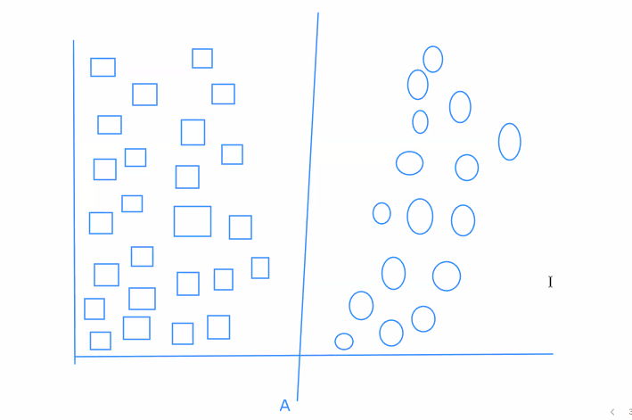
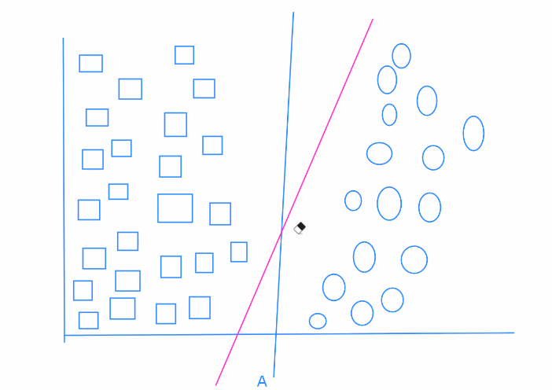
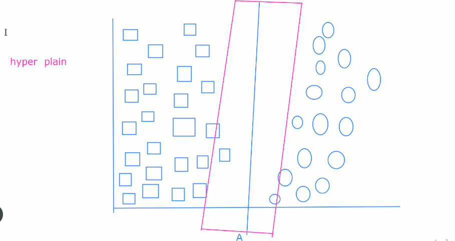
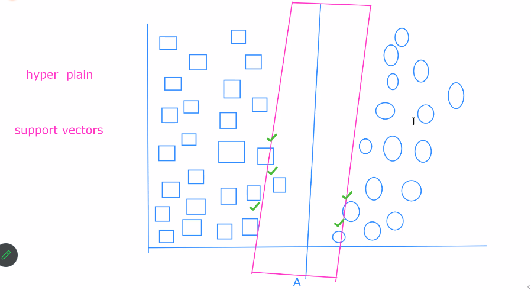

***Support Vector Machine***
--
- Supervised Machine Learning
- Used for classification
- Image classification
  - We commonly use image classification using Deep learning, open CV, CNN.
  - SVM is small projects

***Working***
--
In given image how to find Circles and square
- 

- We can take multiple LSL, but the machine only chooses one LSL. 
- - 

  - The condition: it should be a maximum difference between both categories
- hyper plane
- - 

  - In an n-dimensional space, a hyperplane is an (n-1)-dimensional flat affine subspace. In a two-dimensional space (a plane), a hyperplane is a straight line. In a three-dimensional space, a hyperplane is a flat two-dimensional surface.
- support vector
- - 

  - Support vectors are the data points that lie closest to the hyperplane that separates different classes. They are the most influential points in determining the position and orientation of the decision boundary.
- we can use linearly separate line
  - A "linearly separable" line refers to a scenario in a two-dimensional space where you can draw a straight line (or hyperplane in higher dimensions) that perfectly separates two distinct classes of data points. In other words, data points from one class are located on one side of the line, and data points from the other class are located on the opposite side. The concept of linear separability is fundamental in the context of classification problems in machine learning.

    - Let's break this down further:
    
      - **Data Points:** In the context of a classification problem, data points typically represent observations or examples in your dataset. Each data point is associated with a set of features or attributes. For example, in a simple binary classification problem, each data point might have two features.
    
        - **Classes:** In a classification problem, you have two or more classes or categories into which you want to classify your data points. For a binary classification problem, there are two classes, often referred to as "positive" and "negative" classes.
    
        - **Linear Separability:** Data is considered linearly separable if you can draw a straight line (or a hyperplane, in the case of multi-dimensional data) that effectively separates the data points from different classes. This means that, for any data point on one side of the line, you can be confident that it belongs to one class, and for any data point on the other side, you can be confident that it belongs to the other class.
    
    Here's a graphical representation:
    
    
    
    In the image above, the data points belonging to the two classes (shown in blue and orange) are perfectly separated by the straight line (the decision boundary) in the middle. This is an example of linear separability. Support Vector Machines (SVMs), a popular machine learning algorithm, aim to find this decision boundary while maximizing the margin between the two classes, making them especially well-suited for linearly separable data.
    
    In real-world scenarios, data is not always linearly separable, and you might need more complex algorithms or kernel functions (e.g., polynomial or radial basis function kernels) to handle non-linear separability. However, linear separability is a useful concept to understand when discussing classification problems and the fundamental ideas behind linear classifiers.
    

