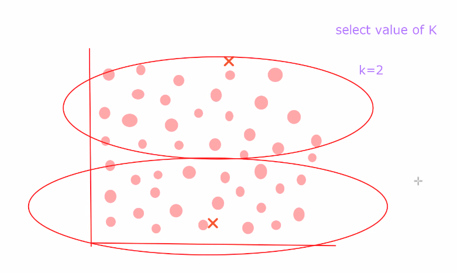
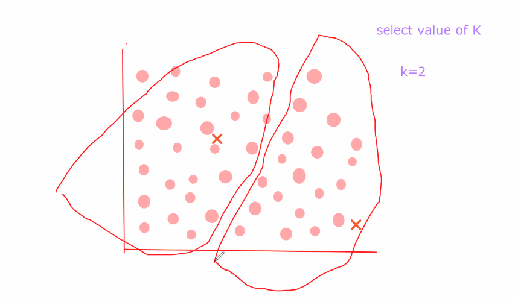
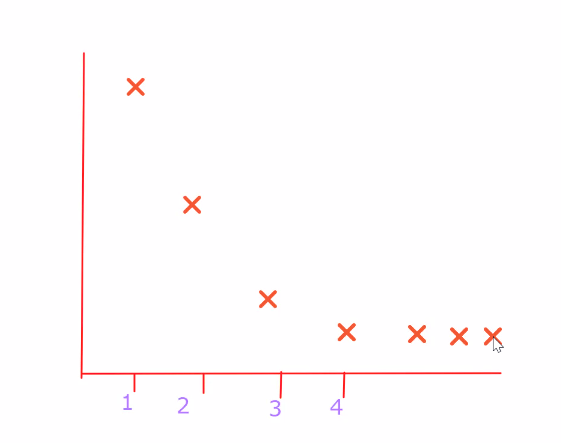
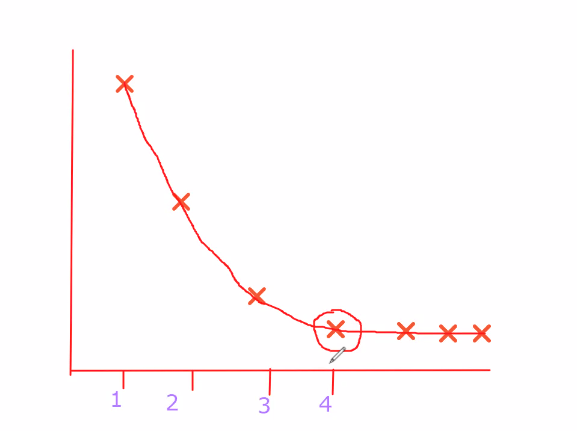

Certainly! Let's break down the K-Means clustering algorithm step by step:

### 1. Initialization:
- **Input:** 
  - \(K\): the number of clusters you want to form.
  - \(n\): the number of data points in your dataset.
  - \(X\): the dataset with \(n\) data points.
  
- **Initialization:**
  - Randomly select \(K\) data points from \(X\) as initial centroids.

### 2. Assignment:
- **Assignment Step:**
  - Assign each data point in \(X\) to the cluster whose centroid is closest. The distance metric is typically Euclidean distance, but other metrics can be used.

### 3. Update Centroids:
- **Update Step:**
  - Recalculate the centroid of each cluster by taking the mean of all the data points assigned to that cluster.

### 4. Repeat Assignment and Update:
- **Iteration:**
  - Repeat the assignment and update steps until convergence. Convergence occurs when the assignments no longer change significantly or a maximum number of iterations is reached.

### 5. Final Result:
- **Output:**
  - The final clusters, each represented by its centroid.

### Objective Function (Minimizing Inertia):
The K-Means algorithm aims to minimize the "inertia" or the within-cluster sum of squared distances. The objective function is defined as:

\[ J = \sum_{i=1}^{K} \sum_{j=1}^{n} ||x_j - c_i||^2 \]

Where:
- \( J \) is the objective function to be minimized.
- \( K \) is the number of clusters.
- \( n \) is the number of data points.
- \( x_j \) is the \( j \)-th data point.
- \( c_i \) is the centroid of the \( i \)-th cluster.

### Notes:
- **Choosing K:**
  - The number of clusters, \( K \), is a parameter that needs to be specified before running the algorithm. It can be chosen based on domain knowledge or using methods like the elbow method.

- **Initialization Sensitivity:**
  - The algorithm's performance can be sensitive to the initial placement of centroids, and multiple runs with different initializations may be needed to find a good solution.

- **Cluster Shape Assumption:**
  - K-Means assumes that clusters are spherical and equally sized, which may not always reflect real-world data.

### Use Cases:
- **Image Compression:**
  - Reduce the number of colors in an image by clustering similar colors together.

- **Customer Segmentation:**
  - Group customers based on purchasing behavior.

- **Anomaly Detection:**
  - Identify outliers or unusual patterns in data.

K-Means is computationally efficient and straightforward, making it one of the most widely used clustering algorithms. However, its limitations should be considered when applying it to certain types of datasets.

---

- ***Selecting centroid***
---
- 
- 
---
- ***Elbow Points***
---
The "elbow point" is a concept used in the context of the K-Means clustering algorithm to help determine the optimal number of clusters (\(K\)). When you plot the cost or distortion (sum of squared distances from each point to its assigned centroid) as a function of the number of clusters, the graph often resembles an arm. The "elbow" of the graph is the point where adding more clusters does not significantly improve the cost.

Here's how the process typically works:

1. **Run K-Means with Different Values of \(K\):**
   - Execute the K-Means algorithm for a range of \(K\) values (e.g., from 1 to a maximum number of clusters you want to consider).

2. **Calculate the Cost for Each \(K\):**
   - For each \(K\), compute the sum of squared distances (cost) for the resulting clusters.

3. **Plot the Elbow Curve:**
   - Plot the cost as a function of \(K\). You'll notice that as \(K\) increases, the cost generally decreases because the data points are closer to their centroids in smaller clusters.

4. **Identify the Elbow Point:**
   - Look for the "elbow" or a point in the graph where the rate of decrease in the cost sharply changes or starts to slow down. This is the point where adding more clusters provides diminishing returns in terms of reducing the cost.

5. **Choose the Optimal \(K\):**
   - The optimal number of clusters is often chosen at the elbow point, as it represents a balance between capturing the variance in the data and avoiding overfitting.

ot, you would typically look for the point where the cost starts to decrease at a slower rate, forming an elbow. That point suggests a good choice for the number of clusters. Keep in mind that the elbow method is a heuristic, and in some cases, the optimal number of clusters may not have a clear elbow.

---
- 
- When the number of clusters increases, variance will decrease; at a point the variance remains constant when the number of clusters increases
- 
- in this case 4 is elbow point