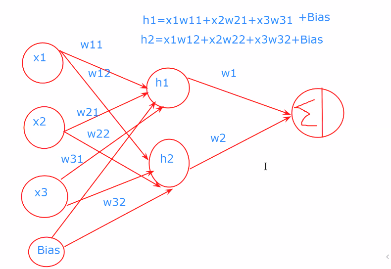
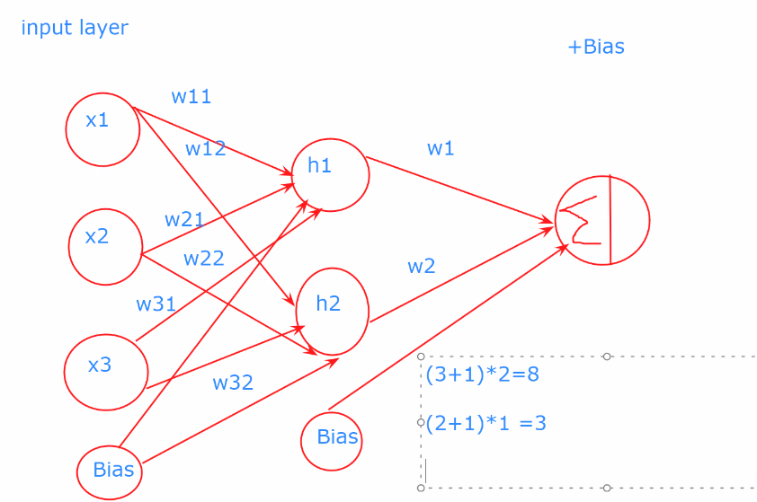

- ***Neural Networks***
  1. Single layer artificial neural networks
  2. Multilayer neural networks

- Single-layer neural network
  - 2 layers 
    1. Input layer
    2. Output layer
  - 
    - Here f(X) is an activation function
    - y(X) is Output
    - w is weight
- Multi-layer Neural network
  -  3 layers
    1. Input layer
    2. Hidden layer
    3. Output layer
  - 
    - feed forward direction
    - backward propagation

---
***Algorithm Steps***
--
1. Initialize input layer
2. Define Weight
3. Feed forward signals
4. Error calculate
5. Backward propagation
6. Repeat step 2

---

***Activation Function***
- Helps to convert input to output
- ReLU (Rectified Linear Unit)
  - ReLU, which stands for Rectified Linear Unit, is an activation function commonly used in the hidden layers of artificial neural networks. It has become one of the most popular activation functions due to its simplicity and effectiveness in mitigating the vanishing gradient problem. The mathematical expression for the ReLU function is given by:
    - X  if  X > 0
    - 0  if  X < 0
- Sigmoid Function
  - The sigmoid function, also known as the logistic function, is a mathematical function commonly used in the context of artificial neural networks, particularly in the output layer of binary classification models. The sigmoid function has an S-shaped curve and maps any real-valued number to a value between 0 and 1. The mathematical form of the sigmoid function is given by:
      -  F(X) = 1 / (1 + e^-X)
  - 

- To reduce errors, we add a bias
  - 
- Adding bias to all layers
  - 
- ***Total number of edges***
  - Total number of edges = (number of input) + 1 Bias * Output neurons
  - to Next hidden layer
    - Total number of edges = (Total artificial neurons) + 1 bias * next layer total number of neurons
  - 
  
---

