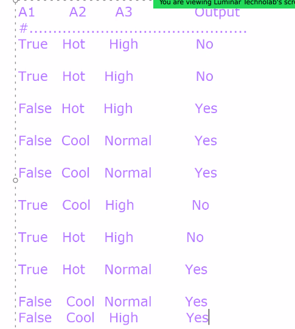
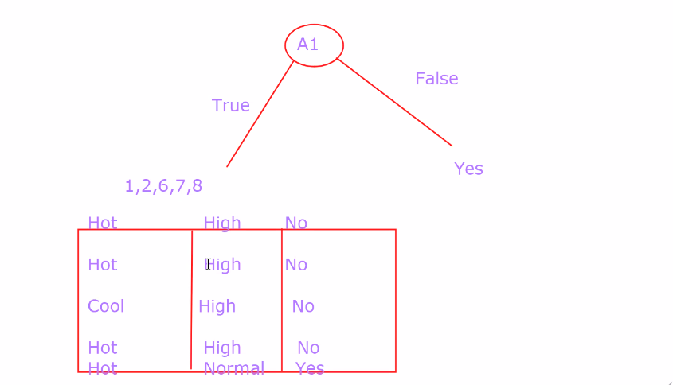

- 

| A1   | A2  | A3     | Output |
|------|-----|--------|--------|
| True | Hot | High   | No     |
| True | Hot | High   | No     |
|False | Hot | High   | Yes    |
| False | Cool | Normal | Yes |
| False | Cool | Normal | yes |
| True | Cool | High   | Yes|
|True | Hot | High   | No |
|True | Hot | Normal | Yes

- E(S1)
---

values : [ 6 +(Yes), 4-(no)]
        : (-6/10) * log2(6/10) - (4/10) * log2(4/10) = 0.97

- A1
---
  - Values : [True, False]
    - Find entropy of True and False
    - E(True) = [1+(Yes), 4-(False)]
      - -(1/5) * log2(1/5) - (4/5) * log2(4/5) = 0.72
    - E(False) = [5+(yes), 0-(No)]
      - here No is 0 so, by homogeneous Entropy = 0 

- E(S2) = (5*10) * 0.72 = 0.36
- Information gain (A1) = 0.97 - 0.36 = 0.61

- A2
---

  - Value : [Hot, Cool]
  - E(Hot) = [2+, 3-]
    -  = (2/5) * log2 (2/5) - (3/5) * log2(3/5) = 0.97
  - E(Cool) = [4+, 1-]
    - -(4/5) * log2(4/5) - (1/5) * log2(1/5) = 0.72
  - E(S2) = 5/10 * 0.97 + 5/ 10 
- Information gain (A1) = 0.97 - 0.84 = 0.13
- A3
----
- 
- Information gain (A3) = 0.97 - 0.55 = 0.42
----
- ** Here Infomation gain is high for A1**
- So split data with A1
- 
