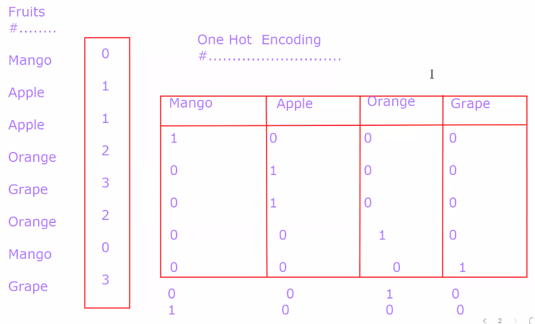

***One Hot Encoding***
----
One-hot encoding is a popular technique for converting categorical data into a numerical format that can be used in machine learning algorithms. It's especially useful when dealing with nominal categorical data, where categories have no inherent order or ranking. One-hot encoding transforms each category into a binary vector, where each category corresponds to a unique binary column.

Here's how one-hot encoding works:

Let's say you have a categorical feature called "Color" with three categories: Red, Green, and Blue. After one-hot encoding, this feature would be split into three binary columns: "Color_Red," "Color_Green," and "Color_Blue."

- For each data point in your dataset, the one-hot encoding process assigns a 1 in the corresponding category's column and 0s in all other columns. For example:

  | Color   | Color_Red | Color_Green | Color_Blue |
  | ------- | --------- | ---------- | ---------- |
  | Red     | 1         | 0          | 0          |
  | Green   | 0         | 1          | 0          |
  | Blue    | 0         | 0          | 1          |
  | Red     | 1         | 0          | 0          |

Advantages of one-hot encoding:

1. **Preservation of Information**: One-hot encoding retains the information about the categorical variable, avoiding any arbitrary numeric assignments that might confuse the model.

2. **Compatibility with Machine Learning Algorithms**: Many machine learning algorithms work with numerical data, and one-hot encoding allows you to use categorical data effectively in these algorithms.

3. **Handling Multicollinearity**: It prevents multicollinearity, which occurs when two or more features are highly correlated. In one-hot encoding, the binary columns are orthogonal (uncorrelated).

4. **Interpretability**: The transformed data is more interpretable because each category gets its own feature column, making it easier to understand the model's behavior.

However, one-hot encoding can also introduce some challenges:

1. **Curse of Dimensionality**: If you have many categories in a categorical variable, one-hot encoding can significantly increase the dimensionality of your dataset, which can lead to a sparse data matrix. This may require more memory and can slow down some algorithms.

2. **Redundancy**: When you have N categories, you only need N-1 one-hot encoded columns to represent the information fully. Including all N columns can introduce redundancy, which doesn't affect most algorithms but may impact interpretability.

3. **New Categories**: It's important to consider how to handle new categories that the model has never seen during training.

4. **Imbalanced Categories**: If your categorical variable has imbalanced categories, one-hot encoding can create problems in terms of class distribution and model performance.

To address some of these challenges, techniques like binary encoding and feature hashing have been developed as alternatives to one-hot encoding. The choice of encoding method depends on the specific problem and the characteristics of the data.

---

***Advantage of one hot encoding over label encoding***
---
One-hot encoding and label encoding are two common techniques used to convert categorical data into a numerical format that can be used in machine learning models. Each method has its advantages and is more suitable for specific scenarios. Here are some advantages of one-hot encoding over label encoding:

1. **Preservation of Categorical Information**:
   - One-hot encoding preserves the categorical information in a more explicit and interpretable manner. Each category is transformed into a separate binary column, making it clear which category each data point belongs to. This is especially useful when there is no intrinsic order or ranking among categories, as it avoids any unintended ordinal relationships.

2. **Avoidance of Misleading Model Interpretation**:
   - Label encoding can inadvertently introduce ordinal relationships between categories, which might lead to misleading interpretations by machine learning models. One-hot encoding ensures that no such relationships are implied, helping to avoid any unintended model biases.

3. **Prevention of Overemphasizing Categories**:
   - In label encoding, assigning integer values to categories can potentially introduce bias in models because the numerical values may be misinterpreted as meaningful information. Models might assume that higher integers represent more significant categories. One-hot encoding removes this risk, as all binary columns are treated equally.

4. **Reduction of Model Bias**:
   - Some machine learning algorithms, such as linear regression, can be influenced by the numerical values assigned to categories in label encoding. One-hot encoding eliminates this potential bias, making it a safer choice in many scenarios.

5. **Applicability to Non-Numerical Models**:
   - One-hot encoding is suitable for a broader range of machine learning algorithms, including those that do not directly support categorical data. It can be used with most models without the need for additional preprocessing.

6. **Use with Nominal Categorical Data**:
   - One-hot encoding is particularly well-suited for nominal categorical data, where categories have no intrinsic order or ranking. It ensures that the model treats all categories equally and is not misled by arbitrary numeric assignments.

While one-hot encoding offers several advantages, it's important to note that it can increase the dimensionality of the dataset, which may lead to a sparse data matrix. This can affect the memory and computational requirements, so it's essential to consider the trade-offs and choose the encoding technique that best fits the specific problem and dataset. In some cases, label encoding or other encoding methods may be more efficient and appropriate, particularly for ordinal categorical data.

---
- 

