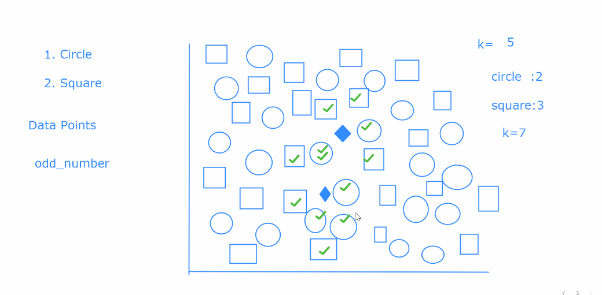
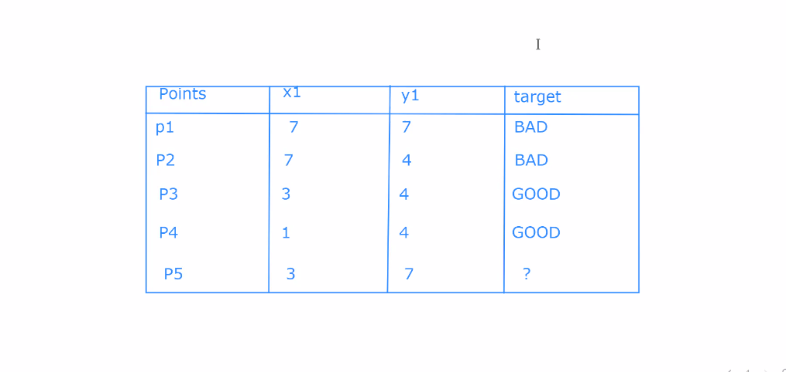

1. KNN Algorithm (K-Neighbors Algorithm)
    - Supervised Learning
    - Used both classification and regression

    - in KNN we should give odd number to K.
- Example 1
- 
- 
  - in this example consider fire point, we give k = 5 then for first point it takes 5 nearest points
    - then we get two circles and three squares, so the shape is predicted as square
  - in the second point we take k = 7 
    - so takes seven nearest shapes so here four circles and three squares
    - so the point is predicted as circle

- Example 2
- 

- Distance formula
   --------

p(X1,Y1) --------- p(X2,Y2)
sqrt((X2-X1)