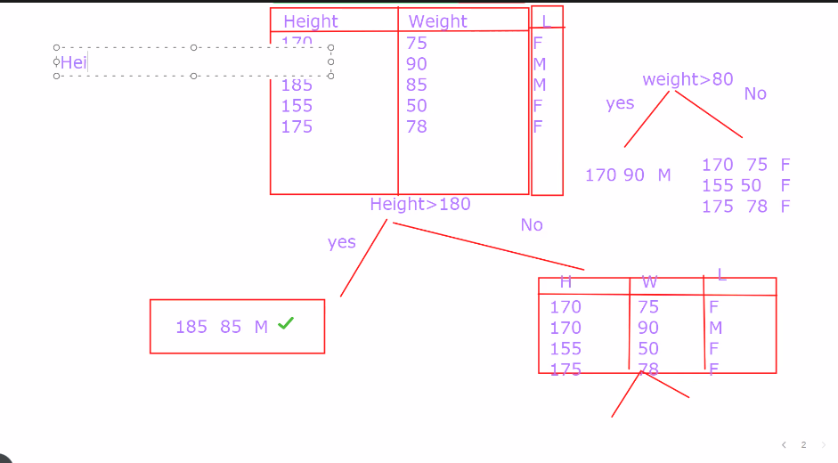
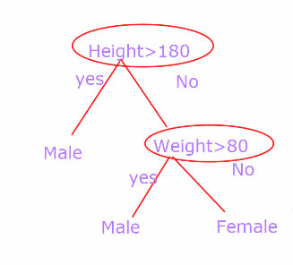
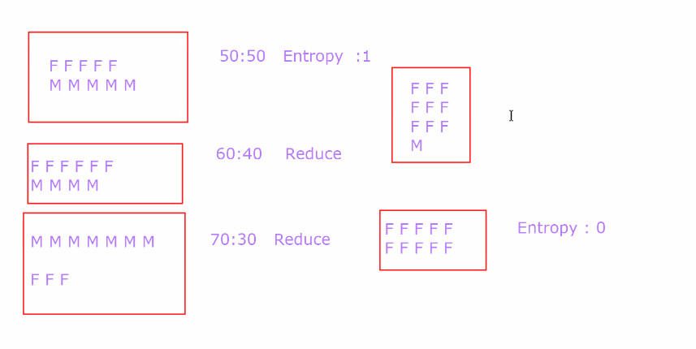
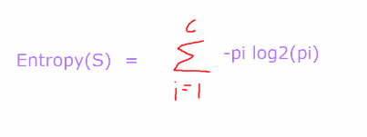
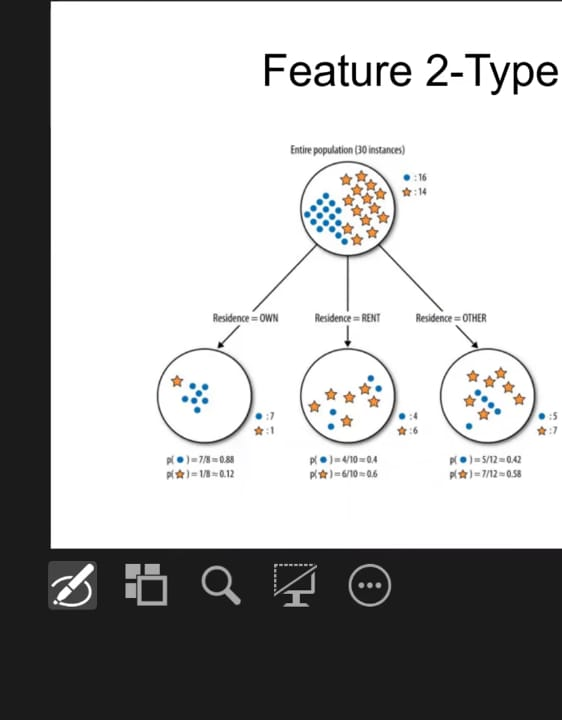
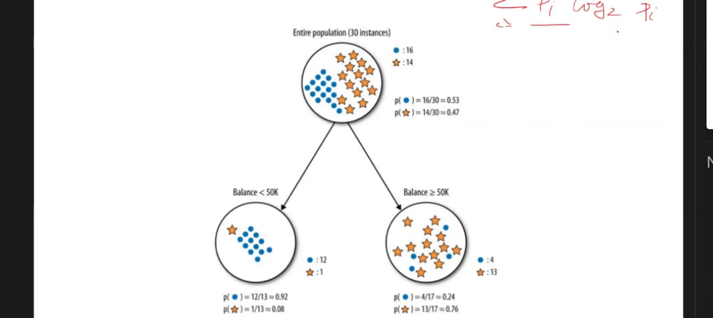

Basic components
1. Leaf 
2. Root node
3. Intermediate node

- Divide and conquer Method
Involves breaking a complex problem into smaller, more manageable subproblems, solving those subproblems independently, and then combining their solutions to solve the original problem. This approach is often used to solve problems that can be divided into similar or identical subproblems.
    - Example
      - | Height | Weight | Gender |
        |--------|--------|--------|
        | 170    | 75     | F      |
        | 170    | 90     | M      |
        | 185    | 85     | M      |
        | 155    | 50     | F      |
        | 175    | 78     | F      |
- 
- Decision Tree
  - Height > 180 is root node 
  - Weight > 80 is an intermediate node
    - 

- ***How to select root node and intermediate node properly***
- It is based on entropy and information gain
  - Entropy
    - Measurement of impurity
    - Measurement of randomness
    - Ranger 0 - 1
    - 50:50 Proportion's entropy is 1
    - 
    - Equation
    - 
  - Information Gain
    -  Information Gain(IG) = E(S1)—E(S2)
      - Where :
        - Entropy(S1): Entropy before split data
        - Entropy(S2): Entropy after split data

- ***Problem***
----
  - 
  - 

For blue
Probability of Entropy before split
    -  ((-16/30) * log2(16/30)) -  ((14/30) * log2(14/30) = 0.996791632