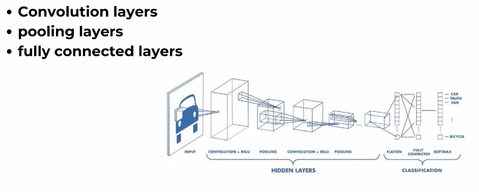

Convolutional Neural Network
---
- It's like ANN but has more functions
- *Image Processing*: CNN is great at understanding images and computer vision tasks
- *spotting Patterns*: They find patterns like edges and textures(*Convolution layers*)
- *Downsizing*: they make things smaller to save time(*Pooling Layers*)
- *Making Sense*: CNN can figure out what's in pictures
- *Transfer Learning*: They can learn from other smart models

---

- *Pooling layer*:typically used to reduce the spatial dimensions of the input volume, effectively down sampling the feature maps. 
        The most common type of pooling layer is the max pooling layer.

***Working***
--
Convolutional Neural Networks (CNNs) are a type of artificial neural network designed for tasks involving visual data, such as image recognition. The key components of a CNN and their working can be simplified as follows:

1. **Convolutional Layers:**
   - **Purpose:** The primary building block of CNNs is the convolutional layer.
   - **Working:** Convolution involves sliding small filters (kernels) over the input image to detect local patterns, such as edges or textures.
   - **Result:** These filters generate feature maps, highlighting important patterns in the input.

2. **Activation Function (ReLU):**
   - **Purpose:** After convolution, an activation function like ReLU is applied element-wise to introduce non-linearity.
   - **Working:** ReLU sets negative values to zero and keeps positive values unchanged.
   - **Result:** Non-linearity enables the network to learn complex relationships and better represent hierarchical features.

3. **Pooling Layers:**
   - **Purpose:** Pooling layers downsample the spatial dimensions of the feature maps.
   - **Working:** Max pooling, for example, selects the maximum value from small regions, reducing the size of the feature maps.
   - **Result:** Downsampling helps focus on the most important features, making computations more efficient and introducing translation invariance.

4. **Flattening:**
   - **Purpose:** Before passing through fully connected layers, the 2D feature maps are flattened into a 1D vector.
   - **Working:** This transformation preserves the spatial relationships learned by the convolutional layers but converts the data into a format suitable for traditional neural network layers.

5. **Fully Connected Layers:**
   - **Purpose:** These layers process the flattened feature vectors for final classification or regression.
   - **Working:** Neurons in fully connected layers are connected to every neuron in the previous layer.
   - **Result:** The network combines high-level features learned from convolutional layers to make predictions.

6. **Output Layer:**
   - **Purpose:** The final layer produces the network's output.
   - **Working:** For classification, a softmax activation is often used to convert raw scores into probabilities.
   - **Result:** The class with the highest probability is predicted.

7. **Training (Backpropagation):**
   - **Purpose:** The network learns by adjusting its weights during training.
   - **Working:** Backpropagation calculates gradients and updates weights using optimization algorithms.
   - **Result:** The model learns to recognize features relevant to the task.

In summary, CNNs use convolutional layers to detect local patterns, activation functions for non-linearity, pooling layers for downsampling, and fully connected layers for high-level feature combination. The network is trained to optimize its parameters for accurate predictions on a specific task, such as image classification.
